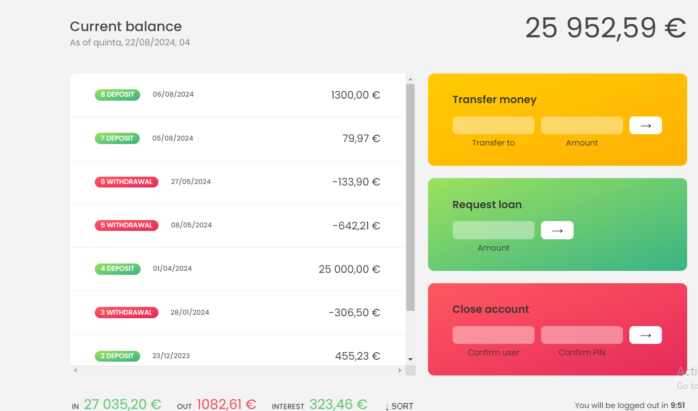

# 🏦 Bankist App

Welcome to **Bankist App** – a feature-rich banking application designed to provide users with an intuitive and seamless banking experience. This project was developed using HTML, CSS, and JavaScript, and it replicates many of the functionalities you would expect from a modern banking application.

## 🌟 Features

- **Account Management**: Create and manage multiple user accounts.
- **Money Transfers**: Easily transfer money between accounts within the application.
- **Loan Applications**: Apply for and manage loans, with real-time updates on your account balance.
- **Account Closure**: Close accounts securely and remove all associated data.
- **Transaction History**: View detailed transaction histories for each account.
- **UI/UX Design**: Responsive and user-friendly interface that works across various devices.

## 🚀 How to Use

1. **Account Setup**: Start by logging in with an existing account.(js 1111) or (jd 2222)
2. **Money Transfer**: Navigate to the transfer section to send money to other users.
3. **Loan Application**: Request a loan, which will be processed instantly.
4. **Transaction History**: Check your transaction history to see all past activities.
5. **Close Account**: If needed, you can securely close your account, and all associated data will be removed.

## 🛠️ Technologies Used

- **HTML**: Structuring the application’s layout.
- **CSS**: Styling the application to make it visually appealing and responsive.
- **JavaScript**: Implementing the application logic, handling user interactions, and processing transactions.

## 📂 Project Structure

|-- index.html # Main HTML file for the Bankist App

|-- style.css # CSS file for styling the app

|-- script.js # JavaScript file for application logic

|-- README.md # Project documentation (this file)

## 📝 Project Overview

Developing **Bankist App** was a challenging yet rewarding journey. The project involved implementing complex features like money transfers, loan processing, and secure account management, all while maintaining a smooth user experience. It’s a demonstration of how web technologies can be leveraged to create functional and interactive applications.

## 🎮 Try the App

To explore the app, simply open the `index.html` file in your browser. Make sure all associated files (`style.css` and `script.js`) are in the same directory.

## 📈 Future Improvements

Some potential enhancements for future versions of the Bankist App include:
- **Authentication**: Implementing user authentication and security measures.
- **API Integration**: Connecting the app to real-world banking APIs for live data.
- **Enhanced Analytics**: Adding features for financial analytics and reporting.

## 🤝 Contributing

If you’d like to contribute to the project or have suggestions, feel free to fork the repository and submit a pull request. All contributions are welcome!

## 📄 License

This project is licensed under the MIT License.

---

Thank you for checking out **Bankist App**! Your feedback and contributions are greatly appreciated.

